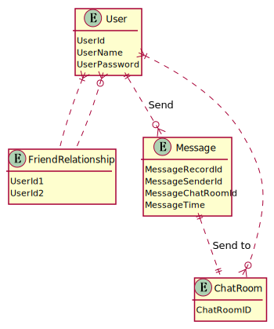

# Wiki - 数据库系统

## 目录

* [介绍](#Description)
* [元素](#Component)
* [实体关系图](#Er)
* [功能](#Function)
* [接口](#Interface)
* [类图](#Class)
* [状态图](#Statu)

<!-- TODO LviatYi -->

## <a id="Description">介绍</a>

提供数据库，提供单例模式的数据库管理程序，并使用适配器模式提供更加直观的数据库操作。

* 数据库构建
* 数据库交互
* 数据库维护

## <a id="Component">元素</a>

### 用户信息

* Id (Key)
  用户 ID （主键）
  6-10
* Name
  用户昵称
  16 以内
* Password (Encrypted)
  用户密码
  8-20 由字母、数字、特殊符号中的任意两种组成。  
* FriendId
  好友 ID （外键）
  数组
* ChatRoomId
  聊天室 ID （外键）

### 好友关系

* (Id1,Id2) (Key)
  用户 1 ID ，用户 2 ID （主键）

### 聊天记录

* RecordId (Key)
  记录 ID （主键）
* SenderId
  发送者 ID （外键）
* ChatRoomId
  聊天室 ID （外键）
* Time
  发送时间

### 聊天室信息

* ChatRoomId (Key)
  聊天室 ID （主键）
* ChatRoomName
  聊天室 Name （允许为空）

当聊天室为群聊时，聊天室 Name 为空。  

## <a id="Er">实体关系图</a>



```PlantUML
@startUML
hide empty members
entity User{
    UserId
    UserName
    UserPassword
}
entity FriendRelationship{
    UserId1
    UserId2
}
entity Message{
    MessageRecordId
    MessageSenderId
    MessageChatRoomId
    MessageTime
}
entity Chatroom{
    ChatRoomID
}

User }|.. FriendRelationship
FriendRelationship ..o{ User
User ||..o{ Message : Send
Message ||..|| Chatroom : Send to
Chatroom }o..|{ User
@endUML
```

## <a id="Interface">接口</a>

数据库系统主要向通讯系统提供接口。  

应实现如下功能：  

* 添加用户  
* 注销用户
* 用户添加聊天室
* 注销聊天室

## <a id="Function">功能</a>

## <a id="Class">类图</a>

<!-- TODO_LviatYi -->

## <a id="Statu">状态图</a>

<!-- TODO_LviatYi -->

[UAS]:./userAuthenticationSystem.md
[CS]:./chatSystem.md
[CMS]:./communicationSystem.md
[DBS]:./databaseSystem.md
[ES]:./encryptionSystem.md
